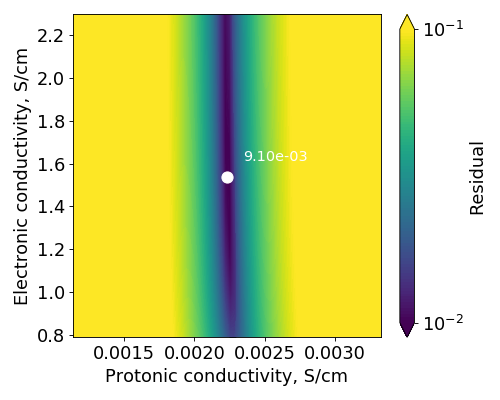
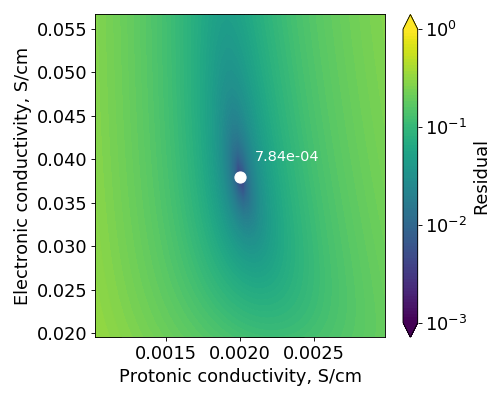

.. footer::
  ###Page###

********************************************
Fitting_HF_impedance_spectra.py, version 0.1
********************************************

This script is for fitting high-frequency linear impedance branches of PEMFC and PEMWE impedance spectra with analytical models from references [1,2]. The fitting produces the estimated effective electronic and protonic conductivities of the catalyst layer of the working electrode (typically PEMFC cathode or PEMWE anode), assuming negligible reference/counter-electrode effects. Ohmic resistances of the protonically and electronically conductive phases are computed based on the fitted conductivities. Note that the fitted spectrum must exhibit a linear high-frequency branch in order for the resulting charge-transport properties to be reliable.

Please refer to [2] for the detailed information about the analytical models used in the fitting. The preprint of [2] is provided with this script for the user's reference.

============
Requirements
============

Python 3 with the following packages:

#. matplotlib
#. numpy
#. scipy
#. sympy
#. time
#. math
#. csv
#. cmath
#. mpmath
#. sys
#. getopt

Please make sure that your Python packages are up-to-date. On most systems, only packages 1-4 need to be installed manually.

=====
Usage
=====

This program is executed in a command line. To use it, you need to open the folder containing the program in the terminal using the instructions below.

#. Windows: open the folder with this program in Windows Explorer, type ``cmd`` in the address bar and press Enter.
#. Mac: open the Terminal application and drag-and-drop the folder with this script from the Finder application into the Terminal window.
#. Linux: right-click on the folder with this program, select "Copy". Open the terminal, type ``cd``, add a space, and press Ctrl+Shift+V to paste the path to the folder. Press Enter.

Now, you can run the program by executing the following command in the terminal::

  python Fitting_HF_impedance_spectra.py --prm=prm_file.txt --threads=2

The input arguments are as follows:

#. `-h, --help`: output a help message
#. `--prm=`: input parameter file
#. `--threads=`: number of CPU threads to use (``H2_O2`` and ``H2_N2`` methods only)
#. `--verbose`: output fitting residual at each iteration
#. `--plot_input_data`: only plot the input spectrum and exit

This script uses text files to supply parameters to the fitting algorithm. These text files are called parameter files. The parameter files supplied with this program contain a detailed description of each input parameter. The input file with impedance data is specified as one of the parameters. The following format of the input file should be followed::

  Frequency_Hz	Z_re_mOhm*cm2	Z_neg_imag_mOhm*cm2
  1.00019535065	100.074120492	6566.8365841
  1.12943855574	97.6168791409	5815.40792241
  1.27538230443	95.6465323303	5149.9744162
  ...
  
All common delimiters are supported (e.g., tabs, semicolons, commas). The headers can be any strings. Impedance must be in mOhm*cm\ :sup:`2`\.

Several CL and MEA example cases from reference [2] are supplied with this script and can be found in Input/Example_data. The tutorials below show how to use the program to fit the example data. The parameter files can then be modified for fitting user-provided impedance data. Do not modify the parameter files directly in the Input folder, but rather copy them somewhere else and modify there. That way, you will always have the original parameter files for your reference.

Three fitting methods are considered. The first method is called ``H2_O2``, because it was derived in [1] for H\ :sub:`2`\/O\ :sub:`2`\  EIS of fuel-cell catalyst layers. However, it is applicable for any faradaic reaction in the working electrode. It is, therefore, suitable for PEMWEs as well, as long as the correct Tafel slope is used in the parameter file. The equation fitted in the ``H2_O2`` method is equation (18) of [2]. The ``H2_N2`` method is used to fit H\ :sub:`2`\/N\ :sub:`2`\  spectra with equation (25) of [2]. The third available technique is a graphical approach to interpreting H\ :sub:`2`\/N\ :sub:`2`\  catalyst-layer spectra, ``H2_N2_graphical``. It relies on equations (21) and (27) of [2] and is described in Section 3.2.2 of that reference.

==================================================================================
Example 1: Fitting impedance spectra of PEMFCs or PEMWEs with the ``H2_O2`` method
==================================================================================

In this example, Input/data_MEA_H2O2.txt parameter file is used to fit the numerically simulated H\ :sub:`2`\/O\ :sub:`2`\  spectrum of a PEMFC with a negligible anodic contribution to impedance (Section 4.6 of [2]). In this example, the input spectrum is fitted with the ``H2_O2`` method.

The contents of this parameter file are shown below. The commented text above each parameter explains its meaning.

.. include:: Input/data_MEA_H2O2.txt
   :literal:
   :start-line: 12

As discussed in [2], the spectrum must be corrected for the ohmic resistance of all cell components except the catalyst layer of interest. This is done automatically by the script using the supplied ``HFR correction, mOhm*cm2`` parameter. Its value is subtracted from the real impedance prior to the fitting.

To identify the linear high-frequency branch (that is indicative of charge transport), the corrected real impedance and the negative imaginary impedance are compared. Only the data points for which they are within a given threshold (``Linear branch threshold``) will be used for fitting. Additionally, ``Real impedance cutoff, mOhm*cm2`` must be specified. It is the approximate maximum value of the real impedance of the linear branch in the original (uncorrected) spectrum. You can run the script with the ``--plot_input_data`` option to see the input spectrum and to estimate the cutoff value. Note that, in order for the fitted conductivities to be accurate, the spectrum must exhibit a high-frequency slope close to 45° [2].

If the linear branch is not present in the measured spectrum, a correction for the external inductance may be required [2]. A correction of the measured spectrum with the methods discussed in [2] may reveal the straight 45° branch at high frequencies. Distortion of this branch may indicate catalyst-layer heterogeneity and strong reference/counter-electrode effects [2]. In these cases, fitting of the spectrum with the considered analytical models is not possible [2].

Closer to the end of the parameter file, search grids for electronic and protonic conductivities are provided. The algorithm of the ``H2_O2`` method first searches for the conductivities from that grid that result in the lowest residual between the analytical and the input spectra. The results are then refined with the Nelder-Mead (downhill simplex) method.

To run this example, execute the following command from the main folder of the script: ::

  python Fitting_HF_impedance_spectra.py --prm=Input/data_MEA_H2O2.txt --threads=2

The following output will appear in the terminal once the fitting is finished: ::

  Reading data from
  Input/Example_data/EIS_results_MEA_sp_const_sp_ACL_x1e4_0p01Apcm2.txt...
  Successfully identified the linear high-frequency impedance branch; 221 data
  points will be used for fitting.
  Fitting the data with the H2/O2 model...
  Fitting finished in 189.8 seconds.
  Residual: 0.009097187607411914
  
  Fitted effective electronic conductivity:  1.5354231811614087  S/cm.
  Fitted effective protonic conductivity:  0.002234008201475828  S/cm.
  Corresponding effective electronic resistance:  0.09769293693126252  mOhm*cm2.
  Corresponding effective protonic resistance:  67.14388957968335  mOhm*cm2.
  R^2:  0.9999987771831228  (real part),  0.9999742506225703  (negative imaginary
  part).
  
  [Note] If conductivity (resistance) A is larger than conductivity (resistance) B
  against the physical expectation,  swap the results. Swapped conductivities
  (resistances) are equally valid.

The fitted conductivities are given in the middle of the output message. Ohmic resistances are computed with equation (21) of [2].
  
The last message indicates that both the fitted conductivities and the swapped values result in the same impedance spectrum and are equally valid fits, as discussed in [2]. The users need to know in advance (from independent measurements) which phase of the catalyst layer is more conductive to correctly assign the fitted conductivities and ohmic resistances to the electronic and protonic phases.
  
The algorithm will generate a Nyquist plot, a Bode plot, and a plot of the residual on the specified grid of conductivities. Only the fitted portion of the spectrum is shown in the Nyquist and Bode plots. The fitted impedance spectrum is automatically saved to the file specified in the parameters (``Output file`` option).
  

  Nyquist plot for data_MEA_H2O2.txt.

  Bode plot for data_MEA_H2O2.txt.

  Residual plot for data_MEA_H2O2.txt.

The residual plot suggests that there is a narrow range of protonic conductivity and a wide range of electronic conducivity that fit the given spectrum. This is because of the lower sensitivity of the catalyst-layer impedance to the phase that is more conductive. In this example, electronic conductivity is much higher than protonic conductivity, and thus the former does not contribute much to the impedance. For that reason, the fitted protonic conductivity is close to the exact value (used to generate the example data) of 2.27 mS/cm, but the electronic conductivity is not as close to the exact 3.79 S/cm.

=================================================================================
Example 2: Fitting impedance spectra of catalyst layers with the ``H2_O2`` method
=================================================================================

In the previous example, impedance spectra of PEMFCs or PEMWEs were considered and had to be corrected for the ohmic resistance of cell components other than the catalyst layer of interest. If the input spectrum has already been ohmic-corrected by the user, parameter ``HFR correction, mOhm*cm2`` must be set to zero. The rest of the parameters are similar to those in the previous example (with minor differences in the conductivity search grid and the impedance-cutoff value). The full list of parameters can be found in Input/data_CL_H2O2.txt. This particular example corresponds to case IV from Section 4.3.1 of [2] (H\ :sub:`2`\/O\ :sub:`2`\  EIS of a catalyst layer at 0.01 A/cm\ :sup:`2`\).

To run this example, execute the following command from the main folder of the script: ::

  python Fitting_HF_impedance_spectra.py --prm=Input/data_CL_H2O2.txt --threads=2

The output is as follows: ::

  Reading data from
  Input/Example_data/EIS_results_CL_Case_IV_H2_O2_0p01Apcm2.txt...
  Successfully identified the linear high-frequency impedance branch; 98 data
  points will be used for fitting.
  Fitting the data with the H2/O2 model...
  Fitting finished in 85.9 seconds.
  Residual: 0.0007844276878988243
  
  Fitted effective electronic conductivity:  0.037923419332504274  S/cm.
  Fitted effective protonic conductivity:  0.001999797344207764  S/cm.
  Corresponding effective electronic resistance:  3.9553395405839513  mOhm*cm2.
  Corresponding effective protonic resistance:  75.00760036233757  mOhm*cm2.
  R^2:  0.9999992857184593  (real part),  0.999998992161329  (negative imaginary
  part).
  
  [Note] If conductivity (resistance) A is larger than conductivity (resistance) B
  against the physical expectation,  swap the results. Swapped conductivities
  (resistances) are equally valid.

The residual plot produced in this example is different from that from Example 1. In this case, only a narrow range of electronic conductivity results in a low residual. This is because the two conductivities of the catalyst layer considered in this example are not too dissimilar. The obtained conductivities are close to the exact values of 37.9 and 2 mS/cm for electronic and protonic phase, respectively [2].
  

  Residual plot for data_CL_H2O2.txt.

=================================================================================
Example 3: Fitting impedance spectra of catalyst layers with the ``H2_N2`` method
=================================================================================

In this example, an H\ :sub:`2`\/N\ :sub:`2`\  spectrum of a catalyst layer is fitted. It is assumed that the input data have already been ohmic-corrected (ohmic correction can be enabled by setting a non-zero ``HFR correction, mOhm*cm2`` value). This example corresponds to case IV from Section 4.3.2 of [2].

.. include:: Input/data_CL_H2N2.txt
   :literal:
   :start-line: 12

The only difference between the parameter sets for H\ :sub:`2`\/O\ :sub:`2`\  and H\ :sub:`2`\/N\ :sub:`2`\  spectra is that the latter set does not require the user to specify the operating current density and the Tafel slope. To fit H\ :sub:`2`\/N\ :sub:`2`\  spectra, the ``H2_N2`` method must be used.

To run this example, execute the following command: ::

  python Fitting_HF_impedance_spectra.py --prm=Input/data_CL_H2N2.txt --threads=2

If you use the script with the ``--plot_input_data`` option, you might need to adjust the ranges of the axes to see your spectrum. When the figure shows, click the menu button that looks like a plot with an arrow to open the axis menu.
  
The output for this example is as follows: ::

  Reading data from Input/Example_data/EIS_results_CL_Case_IV_H2_N2.txt...
  Successfully identified the linear high-frequency impedance branch; 10 data
  points will be used for fitting.
  Fitting the data with the H2/N2 model...
  Fitting finished in 8.4 seconds.
  Residual: 0.0023683756515629427
  
  Fitted effective electronic conductivity:  0.03775576152801514  S/cm.
  Fitted effective protonic conductivity:  0.00208820240020752  S/cm.
  Corresponding effective electronic resistance:  3.972903576284603  mOhm*cm2.
  Corresponding effective protonic resistance:  71.83211741596187  mOhm*cm2.
  R^2:  0.999992326583405  (real part),  0.9999993146611464  (negative imaginary
  part).
  
  [Note] If conductivity (resistance) A is larger than conductivity (resistance) B
  against the physical expectation,  swap the results. Swapped conductivities
  (resistances) are equally valid.

As expected, the results of the H\ :sub:`2`\/N\ :sub:`2`\  fitting are close to those for the low-current H\ :sub:`2`\/O\ :sub:`2`\  fitting from Example 2. The residual plot is also similar.

  Residual plot for data_CL_H2N2.txt.

===========================================================================================
Example 4: Fitting impedance spectra of catalyst layers with the ``H2_N2_graphical`` method
===========================================================================================

When the measured H\ :sub:`2`\/N\ :sub:`2`\  spectrum has a clear 45° branch at high frequencies and a clear 90° (vertical) branch at low frequencies, it is possible to estimate catalyst-layer charge-transport properties with a fast graphical approach described in [2]. The parameter file is shorter in this case.

.. include:: Input/data_CL_H2N2_graphical.txt
   :literal:
   :start-line: 12

The only new parameter in this case is ``Number of low-frequency points to fit``. It controls how many impedance points at the lowest frequencies available in the dataset will be used for identifying the location of the vertical branch. Those points are fitted with a straight line that is extrapolated to the real axis. The intersection point is the DC resistance of the catalyst layer. It is important to ensure that the slope of the low-frequency branch is close to 90°, otherwise the DC resistance and, in turn, the estimated charge-transport properties will be inaccurate.

To run this example, execute the following command: ::

  python Fitting_HF_impedance_spectra.py --prm=Input/data_CL_H2N2.txt

The output for this example is as follows: ::

  Reading data from Input/Example_data/EIS_results_CL_Case_IV_H2_N2.txt...
  Successfully identified the linear high-frequency impedance branch; 10 data
  points will be used for fitting.
  Slope of the low-frequency fit is  89.82053471363677  degrees.
  Slope of the high-frequency fit is  44.80827071073536  degrees.
  Fitted effective electronic conductivity:  0.0019844246915927018  S/cm.
  Fitted effective protonic conductivity:  0.03856844060512938  S/cm.
  Corresponding effective electronic resistance:  75.58865833281372  mOhm*cm2.
  Corresponding effective protonic resistance:  3.889190168089162  mOhm*cm2.
  R^2:  0.9998641819587986  (linear low-frequency fit),  0.9999279269493262
  (linear high-freqiency fit).
  
  [Note] If conductivity (resistance) A is larger than conductivity (resistance) B
  against the physical expectation,  swap the results. Swapped conductivities
  (resistances) are equally valid.

Note that the slopes of the straight high-frequency and low-frequency lines are computed and shown in the output. In this case, they are sufficiantly close to 45° and 90°. The corresponding lines are indicated in blue in the generated Nyquist plot. The red line shows the spectrum computed with equation (25) of [2] using the conductivities fitted in this example.
  

  Nyquist plot for data_CL_H2N2_graphical.txt.

  Bode plot for data_CL_H2N2_graphical.txt.

As expected, the resulting conductivities are close to those obtained in Examples 2 and 3. Note that the fitted values were swapped in this example (both pairs are valid).

=========
Copyright
=========

Copyright 2020 Aslan Kosakian, Marc Secanell

Energy Systems Design Laboratory, University of Alberta, Canada

=======
License
=======

Distributed under the MIT license. See LICENSE.txt for details.

==========
References
==========

#. A. Kulikovsky. "A model for impedance of a PEM fuel cell cathode with poor electron conductivity." Journal of Electroanalytical Chemistry 801 (2017): 122-128.
#. A. Kosakian, M. Secanell. "Estimating charge-transport properties of fuel-cell and electrolyzer catalyst layers via electrochemical impedance spectroscopy." Electrochimica Acta (2020) (Accepted).
